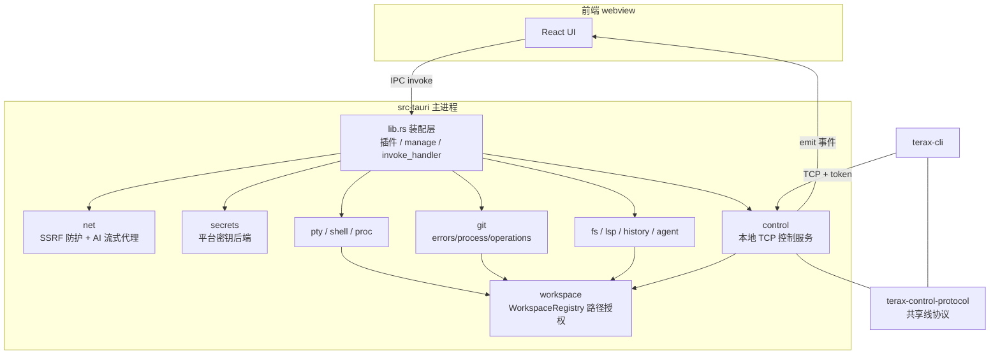

# terax-ai/src-tauri 架构分析与可借鉴点

分析对象：`D:\MyProgram\seclead\wkspace\terax-ai\src-tauri`（terax 0.8.6，Rust 2021 + Tauri 2）
分析工具：codegraph 1.5.0（索引 50 文件 / 1430 节点 / 4192 边，状态 up to date）+ 源码精读
分析目的：为 kiro-rs 找出可迁移的工程实践，而非全面评价对方项目

## 一、目标项目架构概览

这是一个 AI-native 终端模拟器的 Rust 后端。前端（Vite + React）通过 Tauri IPC 调用命令，Rust 侧负责所有需要系统权限的操作：PTY、文件系统、Git、LSP、进程、密钥、网络。

分层是「薄入口 + 模块自治」：

- `src/main.rs`（634 字节）只调 `terax_lib::run()`
- `src/lib.rs`（16 KB）是唯一的装配点：注册插件、`manage` 全部状态、`generate_handler!` 列出全部 IPC 命令
- `src/modules/*` 是 12 个平级能力模块，模块内再按职责拆文件
- `crates/terax-control-protocol` 把线协议单独抽成 crate，被主程序和 `terax-cli` 共享



codegraph 的影响面分析证实了这张图的关键结构：`WorkspaceRegistry::is_authorized` 一个方法牵动 40 个符号，覆盖 git 的 20 个操作、shell 的 4 个入口、lsp/fs/control 各自的入口。授权不是散落在各处的 if，而是一条被强制经过的通道。

```
codegraph impact is_authorized  -> 40 affected symbols
codegraph callers authorize_spawn_cwd -> lsp_spawn / shell_run_command /
  shell_session_open / shell_session_run / shell_bg_spawn（+ 5 个测试）
```

## 二、值得借鉴的做法（按对 kiro-rs 的价值排序）

### 1. SSRF 分级 + DNS 重绑定防护（最高价值）

`src/modules/net.rs` 把「出站请求安全」做成了一等公民：

- `ip_kind()` 把 IP 分成 `Public / Private / Loopback / BlockedMetadata` 四类，云元数据地址（`169.254.169.254`、`fd00:ec2::254`、`fe80::/10`）直接拒绝
- `classify_and_collect_safe_ips()` 解析一次 DNS，然后用 `reqwest` 的 `resolve_to_addrs` 把连接钉在刚校验过的 IP 上，堵掉「校验时是公网 IP、连接时变成内网 IP」的重绑定窗口
- `redirect::Policy::custom` 在每一跳重定向上重跑同一套判定，而不是只查首个 URL
- `sanitize_headers()` 拒绝 hop-by-hop 头（`host`、`connection`、`transfer-encoding` 等）和含 CR/LF/NUL 的头值，堵掉 header 注入
- 访问私网需要调用方显式传 `allow_private_network: true`，默认关闭

对 kiro-rs 的落点：`src/http_client.rs` 的 `build_client()` 目前只设了 `timeout` + TLS 后端 + 可选代理，没有重定向策略，也没有目标地址分级。kiro-rs 的上游 base URL 与代理地址来自配置文件和 Admin API，属于「可被运维输入影响的出站目标」，加一层地址判定与重定向收口是低成本高收益的。

### 2. 错误分类先行，而不是 `String` 到处传

`src/modules/git/errors.rs` 用一个 `GitError` 枚举把 git 的失败拆成 16 个语义变体：`NotInstalled`、`TooOld { found, required }`、`NoUpstream`、`AuthRequired`、`HostKeyUnverified`、`TimedOut`、`FileTooLarge`、`SymlinkRejected`、`PathOutsideWorkspace`……每个 `Display` 都带可执行的下一步建议（「Run `git push -u <remote> <branch>` in the terminal first」）。

更关键的是 `classify_auth_error()`：把 stderr 文本匹配集中在一个函数里，认证失败与主机密钥失败被识别成独立变体，而不是笼统的「命令失败」。

对 kiro-rs 的落点：`AdminServiceError` 只有 5 个变体，其中 `UpstreamError(String)` 和 `InternalError(String)` 承担了太多语义。Token 刷新失败、凭据过期、配额耗尽、上游 429、网络超时在当前结构里都会塌缩成同一个 `UpstreamError`，前端和日志无法据此分流。按失败原因细分变体，且每个变体自带处置建议，是可以直接搬的模式。

### 3. 有界环形缓冲区处理长流输出

`src/modules/shell/ringbuffer.rs` 的 `BoundedRingBuffer` 值得单独看：容量固定，但 `next_offset` 单调递增，并单独记录 `dropped` 字节数。调用方用 `read_from(since_offset)` 增量拉取，能明确知道「你漏了 N 字节」，而不是静默丢数据。

对 kiro-rs 的落点：SSE 流式转换目前是边到边转发。若要做流内容审计、断线重连续传或调试期回放，这个「有界 + 单调 offset + 显式丢弃计数」的结构比无界 Vec 或静默截断都更合适。

### 4. 本地控制服务的认证与限流写法

`src/modules/control.rs` 是一个绑在 `127.0.0.1:0` 的 TCP 服务，给 CLI 反向调用 GUI 用。它的防护是分层的：

- 32 字节随机 token（`getrandom`），`constant_time_eq` 逐字节比较
- token 写在 `cache_dir/terax/control.json`，目录 `0o700`、文件 `0o600`，用 `NamedTempFile` + `persist` 原子发布
- `MAX_MESSAGE_BYTES` 64 KB 帧上限、`MAX_CONNECTIONS` 32 并发上限、`MAX_PENDING_REQUESTS` 32 待处理上限，超限返回 `server_busy` 而不是排队堆积
- 请求 id 限制为 1-128 个安全 ASCII 字符，避免换行注入污染日志
- 退出时 `remove_own_descriptor` 会先比对 token 才删文件，避免误删新实例的描述符
- 按 PID 命名的 launcher 目录 + 启动时 `sweep_stale_launcher_dirs` 清理死进程残留

对 kiro-rs 的落点：kiro-rs 已有 `subtle::ConstantTimeEq` 和 `write_atomic`，方向一致。缺的是「并发与待处理量的显式上限」和「请求 id 字符白名单」。Admin API 目前没有连接数或并发请求数封顶，超载时行为不可预期。

### 5. 单一入口做路径/字符串规范化

`src/modules/fs/mod.rs` 的 `to_canon()` 是全项目唯一的「规范路径转展示字符串」出口，注释直接写明「Route every such conversion through here」。它剥掉 Windows 的 `\\?\` 与 `\\?\UNC\` 前缀，统一成正斜杠，并用 proptest 验证幂等性与「输出绝不含反斜杠」。

这条纪律的价值在于：跨平台路径处理的 bug 通常来自「有些地方转了、有些地方没转」。收成一个函数后，测试只需覆盖一处。

### 6. 危险输入的白名单校验 + 明确失败值

`workspace.rs` 的 `is_safe_distro_name()` 用白名单（仅字母数字与 `. _ - 空格`，禁止 `..` 与前导点）校验 WSL 发行版名，因为这个名字会被拼进 UNC 路径 `\\wsl.localhost\<distro>\`。校验失败时不 panic、不静默通过，而是返回一个必然无效的哨兵路径 `\\wsl.localhost\__terax_invalid_distro__`，让下游的 `is_dir()` 自然拒绝。

`git/utils.rs` 的 `is_safe_pathspec()` 同理：拒绝 `:`、NUL、控制字符和 `.`/`..` 组件，然后 `resolve_within_repo()` 再用 `canonicalize` + `starts_with(repo_root)` 二次确认。删除中的文件走 `resolve_deleted_within_repo()`，逐级向上找最近的存在祖先再校验——这个细节说明作者认真处理了「路径不存在时无法 canonicalize」这个真实边界。

### 7. 进程治理：超时、封顶、不留孤儿

`git/process.rs` 与 `shell/mod.rs` 共用同一套外部命令执行范式：

- `SharedChild` + `recv_timeout`，超时后 `kill` 再 `wait`，避免僵尸
- stdout/stderr 各起一个线程 `drain`，输出超过 `MAX_OUTPUT_BYTES` 后继续读但丢弃，并置 `truncated` 标志——既不阻塞子进程，也不无界吃内存
- 环境变量预先禁掉所有交互式提示：`GIT_TERMINAL_PROMPT=0`、`GIT_ASKPASS=`、`SSH_ASKPASS=`、`GCM_INTERACTIVE=Never`、`LC_ALL=C`。最后一个尤其重要：锁定 locale 才能稳定解析 git 输出
- Windows 侧 `proc/job.rs` 用 Job Object + `KILL_ON_JOB_CLOSE`，handle 一 drop 整个进程树就被杀，这是 Windows 上唯一可靠的孤儿进程防线
- git 可用性检查带 60 秒 TTL 缓存，并按 workspace 分 key，同时主动 `prune_expired_availability_entries`

### 8. 平台差异收在模块内部，不外泄

`secrets.rs` 的模块注释解释了为什么 Linux 不用 `keyring`：Secret Service 依赖 D-Bus 守护进程，AppImage/deb 分发场景无法假设它存在，所以退回 `0o600` 文件（并说明这与 Chromium 的降级路径一致）。而对外只暴露 `secrets_get/set/delete/get_all` 四个命令，「no platform branching in JS」。

`secrets_get_all` 的批量读接口也值得注意：冷启动时前端要读多个密钥，批量接口把 N 次 IPC 往返压成一次。

### 9. 纯函数化以换取可测性

反复出现的手法：把带副作用的逻辑剥出一个纯函数，然后重点测这个纯函数。

- `resolve_launch_target(Vec<LaunchEntry>)` 不碰 fs/env，注释写明「Kept free of fs/env access so it stays unit-testable」，5 个单测覆盖参数组合
- `compute_appimage_env_overrides(appdir, read_fn)` 把环境变量读取注入为闭包参数，测试传假 reader
- `launcher_dir_is_stale(name, modified, now, is_alive)` 把「进程是否存活」也注入为闭包，于是过期判定可以在任意主机上确定性测试
- `strip_verbatim` 配 proptest 做性质测试

50 个源文件里内嵌了 737 个函数节点，测试与实现同文件，加上 4 个独立集成测试文件。测试写在紧邻实现处，降低了「改了实现忘了测试」的概率。

## 三、不建议照搬的部分

- **Tauri 特有机制**：`invoke_handler`、`manage`、`Channel`、`capabilities/*.json` 的权限模型都绑在桌面 IPC 模型上，kiro-rs 是 Axum HTTP 服务，对应位置是 middleware 与 extractor，形式不可平移。
- **`lib.rs` 单点装配**：对方 12 个模块、命令清单约 90 项，集中列出仍可读。kiro-rs 已有 `admin`/`anthropic`/`openai`/`public_api` 多路由树，各自挂 auth/cors/body-limit，继续保持分散装配更合适——AGENTS.md 里已经记了「merge 不传播 layer」这个坑。
- **`Result<T, String>` 作为 IPC 边界类型**：对方在命令层把错误压成 `String`（受 Tauri IPC 序列化约束），内部才用 `GitError`。值得借的是内部的枚举，不是边界上的 `String`。

## 四、kiro-rs 的具体落点建议

按投入产出排序。每项都需要按 AGENTS.md 判断是否先建 OpenSpec change。

| 优先级 | 建议 | 落点 | OpenSpec |
| --- | --- | --- | --- |
| P0 | 出站请求加地址分级与重定向策略：`redirect::Policy::custom` 逐跳校验，拒绝云元数据地址，私网访问需显式开关 | `src/http_client.rs` | 需要（配置 schema + 行为变化） |
| P1 | 细分 `AdminServiceError`：把 `UpstreamError(String)` 拆成 token 过期 / 配额耗尽 / 上游限流 / 网络超时等变体，`Display` 带处置建议 | `src/admin/error.rs` | 需要（Admin API 契约） |
| P1 | Admin API 加并发与待处理上限，超限返回明确的 busy 语义而非无界排队 | `src/admin/`、middleware | 需要（认证中间件相邻） |
| P2 | 大文件按职责拆分：`token_manager.rs` 3981 行、`admin/service.rs` 2112 行，可参考 `git/{errors,process,operations,parser,types,utils}` 的切法 | `src/kiro/token_manager.rs` | 需要（大范围重构） |
| P2 | SSE 流式引入有界环形缓冲，带单调 offset 与显式丢弃计数，支撑审计与调试回放 | `src/anthropic/stream.rs` | 需要（SSE 流式） |
| P3 | 提炼纯函数并注入外部依赖（时间、环境、存活判定），提升现有测试的确定性 | 各模块测试 | 可豁免（无行为变化时） |

## 五、验证说明

本次为只读分析，未修改任何代码，因此未运行 `cargo check --release --all-targets`。

实际执行过的命令：

- `codegraph status`（两个项目，均报告 index up to date）
- `codegraph query authorize`、`codegraph impact is_authorized`、`codegraph callers authorize_spawn_cwd`
- `rg` 检索 kiro-rs 侧的 `reqwest` client 构建、错误枚举、并发上限、`constant_time_eq`
- 精读 terax 侧 `lib.rs`、`net.rs`、`secrets.rs`、`workspace.rs`、`control.rs`、`shell/mod.rs`、`shell/ringbuffer.rs`、`proc/{mod,job}.rs`、`git/{errors,process,utils}.rs`、`fs/mod.rs`、`crates/terax-control-protocol/src/lib.rs`

未验证的部分与残余风险：

- 未构建或运行 terax 项目，上述行为结论来自源码与其内嵌测试的断言，未经运行时确认
- 未精读 `pty/shell_init.rs`（39 KB）、`git/operations.rs`（39 KB）、`agent.rs`、`lsp/`、`history/`，这些模块与 kiro-rs 的职责重叠低
- 第四节的落点建议是基于结构对比的判断，具体改动的收益与代价需在各自 OpenSpec change 中单独论证
- terax 的 codegraph 索引由较早引擎版本构建（kiro.rs 侧提示 `Index was built by an earlier version`），符号统计可能与最新引擎略有差异，但不影响本次的结构性结论
