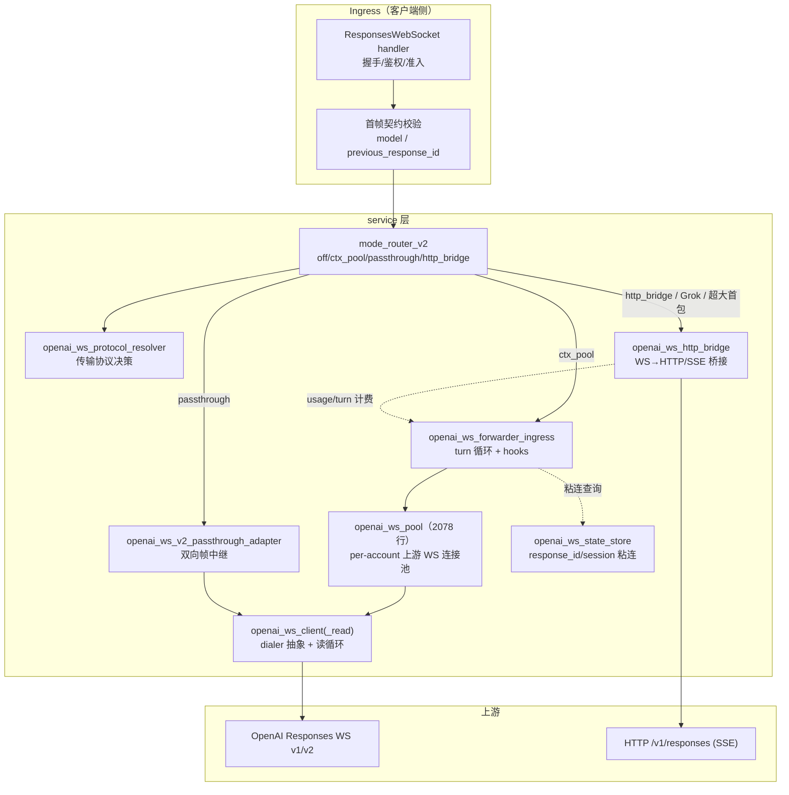
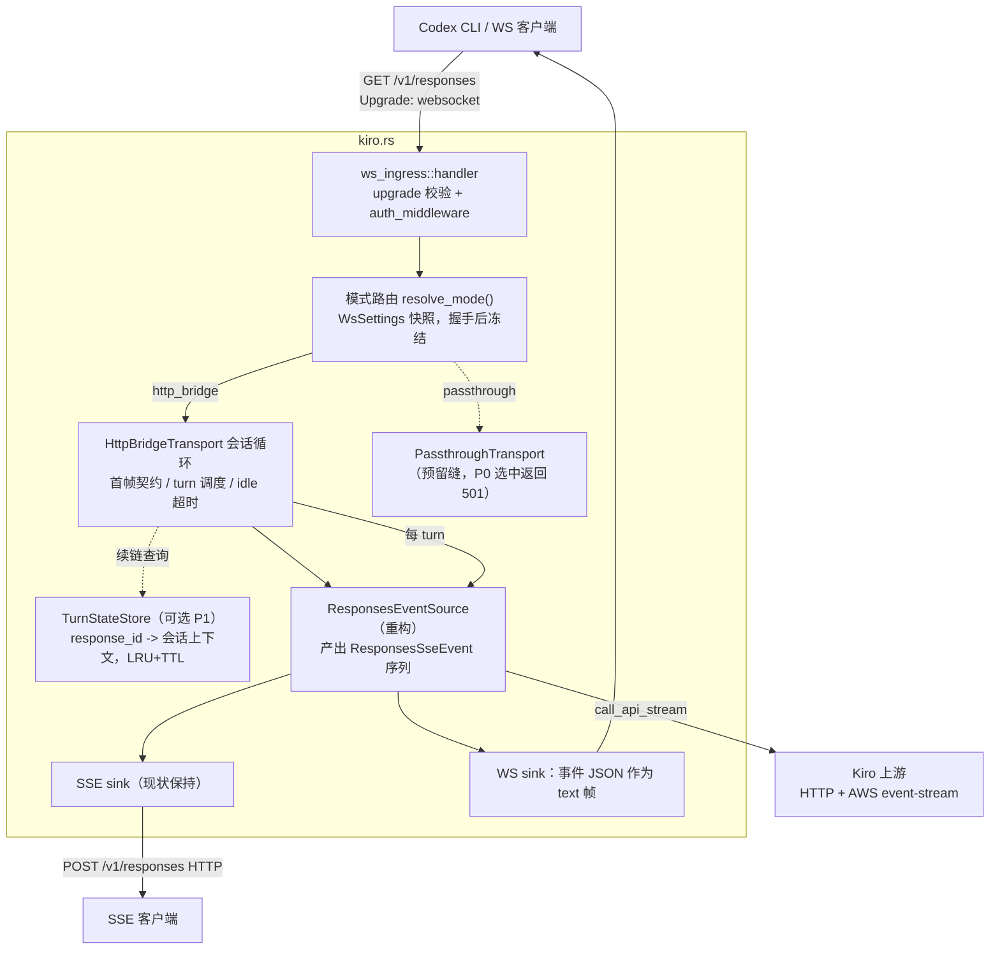

# WebSocket（OpenAI Responses WS）支持优化设计

> 状态：**提案**（实现前须建 OpenSpec change，见 §6.4）
> 日期：2026-08-14（v2 修订：新增透传 WS 扩展框架 §4.6、配置化开关与热加载 §4.7，
> 同步修订 §4.1–§4.3、§4.8–§4.12、§6、§7、§8）
> 分析手段：CodeGraph（sub2api 索引：3,085 文件 / 93,235 节点 / 324,648 边，`codegraph query/explore/callees`）
> + sub2api 源码精读（`backend/internal/{handler,service,config,server/routes}`）
> + kiro.rs 源码精读（含 `file:line` 复核）

---

## 1. 背景与动机

### 1.1 为什么 kiro.rs 需要 WebSocket

kiro.rs 当前把 Anthropic Messages / OpenAI Chat Completions / OpenAI Responses 三种协议
代理到上游 Kiro（AWS event-stream），全部走 **HTTP + SSE** 一条传输层。但客户端生态正在向
WebSocket 迁移：

1. **OpenAI Responses API 官方提供 WebSocket 传输**（`GET /v1/responses` +
   `Upgrade: websocket`），Codex CLI 的 ws 模式直连该端点。sub2api 为此实现了完整 WS 网关。
2. Codex 的 `models.json` 里存在 `prefer_websockets` 元数据（见
   `docs/codex-responses-lite-wire-analysis.md:253`），kiro.rs 目前未消费该字段。
3. WS 持久连接天然适配多轮 Agent 会话：一次握手、多轮 `response.create`，免去每轮重建
   TLS / 鉴权 / 连接开销，且支持 `response.cancel` 这类带内控制。

结论：kiro.rs 若要作为 Codex CLI / 新式 Agent 客户端的接入层，需要补齐
**Responses WebSocket ingress**。

### 1.2 约束前提

- Kiro 上游是 `generateAssistantResponse` HTTP + AWS event-stream，**没有上游 WS**。
  因此 kiro.rs 的 WS 支持在 sub2api 的术语体系里只能是 **http_bridge 模式**
  （客户端保持 WS，每个 turn 翻译为一次上游 HTTP/SSE 调用），而非 WS→WS 透传。
- kiro.rs 是单实例、单 API Key、多凭据（MultiTokenManager）架构，没有 sub2api 的
  多账号调度 / Redis / 分组计费层，设计必须按此裁剪。

---

## 2. sub2api 的 WebSocket 实现分析（CodeGraph）

### 2.1 入口与路由

`backend/internal/server/routes/gateway.go` 中 WS 相关路由共四类：

| 路由 | Handler | 用途 |
| --- | --- | --- |
| `GET /v1/responses`、`GET /responses`、`GET /backend-api/codex/responses`（:221 / :356 / :369） | `OpenAIGatewayHandler.ResponsesWebSocket`（`handler/openai_gateway_handler.go:1587`） | OpenAI Responses WebSocket API，Codex CLI ws 模式入口 |
| `POST /v1/live` + `GET /v1/live/:call_id` | `Live` / `LiveSideband`（`handler/openai_live.go`） | WebRTC SDP 交换 + sideband WS 代理 |
| `GET /v1/realtime` | `GrokRealtime`（`handler/grok_audio.go`） | xAI Realtime WS 中继 |
| admin 内部 | `handleQPSWebSocket`（`handler/admin/ops_ws_handler.go:421`，gorilla/websocket） | 运维大盘实时推送 |

WS 路由与 HTTP 路由共用同一套 API Key 鉴权中间件；`GET /v1/responses` 只接受
`Upgrade: websocket` 请求，否则回 426。

### 2.2 模块架构



### 2.3 握手与准入（`ResponsesWebSocket`）

握手阶段在 **accept 之前** 完成全部拒绝性检查，避免 WS 连接成为资源耗尽通道：

1. `isOpenAIWSUpgradeRequest` 校验 → 非 upgrade 请求回 `426 Upgrade Required`；
2. API Key 鉴权（与 HTTP 同一中间件）；
3. **ingress 租约**：`AcquireOpenAIWSIngressLease(apiKeyID, MaxIngressConnectionsPerAPIKey)`，
   超限回 `429 + Retry-After: 5`。租约丢失时连接以 `1013 Try Again Later` 关闭；
4. `coderws.Accept`，启用 `CompressionContextTakeover`（permessage-deflate 带上下文接管）；
5. `SetReadLimit`（默认 64MB，可配）——Codex 大 delta / rate_limits 事件可超过库默认 32KB；
6. **首帧超时**：N 秒内必须收到首条 `response.create`，否则 `1008 Policy Violation` 关闭；
7. 首帧校验：必须是合法 JSON、必须带 `model`、`previous_response_id` 必须是 `resp_*`
   而非 message id；
8. 安全审计（内容审核）、图像意图、会话封禁检查在首帧上做第一阶段判定。

### 2.4 Ingress 模式与协议决策

- `OpenAIWSProtocolResolver.Resolve(account)`（`openai_ws_protocol_resolver.go`）输出
  上游传输决策：`http_sse` / `responses_websockets`（v1）/ `responses_websockets_v2`。
  输入：全局开关（`enabled`/`force_http` 紧急回滚）、账号类型开关（OAuth/APIKey）、
  账号级 `force_http`、mode_router_v2 的账号模式。
- `openai_ws_forwarder_ingress.go:ProxyResponsesWebSocketFromClient` 按模式分派：
  - `ctx_pool`：默认。池化上游 WS 连接，每 turn 取连接 → 写 `response.create` →
    读事件到终态 → 归还。`OpenAIWSIngressHooks`（`BeforeTurn` / `BeforeRequest` /
    `MapRequestModel` / `AfterTurn`）承载计费、模型映射、安全审计；
  - `passthrough`（v2）：双向帧中继，只在首帧做准入与模型白名单检查，
    处理 `session.update`（会话级改 model）、拒绝重叠 `response.create`
    （`openai_ws_v2_passthrough_adapter.go`）；
  - `http_bridge`：客户端保持 WS，每 turn 走 HTTP SSE（见 §2.6）。
- beta 协议版本：`responses_websockets=2026-02-04`（v1）/ `2026-02-06`（v2），
  turn 级头部 `x-codex-turn-state` / `x-codex-turn-metadata`（`openai_ws_forwarder.go` 常量区）。

### 2.5 上游连接池与状态粘连

- `openai_ws_pool.go`（2078 行）：per-account 池（`sync.Map[accountID]*openAIWSAccountPool`）。
  容量可静态（`max_conns_per_account`）或按账号并发动态计算
  （`ceil(concurrency * factor)`）；支持 min/max idle、预热（prewarm）、空闲探测、
  排队与 acquire 超时（dial+2s，不叠加 write_timeout 以免 TTFT 长尾）、
  凭据恢复后的 generation guard 防旧预热连接回池、指标快照。
- `openai_ws_state_store.go`：WSv2 多轮会话的粘连状态，全部有界 + 增量清理：
  - `response_id -> account_id`：本地热缓存 + Redis，供 `previous_response_id` 续链跨请求路由；
  - `response_id -> conn_id`：进程内，会话复用同一上游连接；
  - `session_hash -> turn_state / conn_id`：`x-codex-turn-state` 绑定。
  - 每个 map 上限 65536，每分钟增量清理（每次 ≤512 项），缓存读失败按未命中降级不阻断主流程。

### 2.6 HTTP 桥接（kiro.rs 最该借鉴的部分）

`openai_ws_http_bridge.go`：当上游无 WS（Grok）或首包超过阈值（默认 15MB）时，
保持客户端 WS，把每个 turn 翻译成一次 HTTP 调用：

1. `prepareOpenAIWSHTTPBridgeBody`：从 `response.create` payload 删 `type` / `generate` /
   `previous_response_id`，注入 `stream=true`，得到标准 HTTP Responses 请求体；
2. 走既有 HTTP 上游（复用 failover / 账号错误处理 / 代理）；
3. 逐行解析上游 SSE，每条 data 直接作为 WS text 帧转发给客户端（事件 JSON 与 WS 协议同形）；
   期间完成：模型名回写（上游模型 → 客户端模型）、tool call 纠错、usage 采集、
   tool-call replay 收集（供后续 turn 重建上下文）、图像计数；
4. **failover 仅当 `turn == 1 && !wroteDownstream`**——一旦给客户端写过任何事件，
   错误只能以 `error` / `response.failed` 事件表达，连接保持存活；
5. 客户端中途断开：标记 `clientDisconnected` 后**继续抽干上游流**，保证 usage/计费完整；
6. 容量降载错误（`server_is_overloaded` / `slow_down`）在写给客户端的副本里改写，
   让 Codex 走内置重试而不是判致命终止会话。

### 2.7 错误分类、重试与降级

`openai_ws_forwarder.go` 定义三类错误，是整个 WS 层的安全边界：

| 错误类型 | 语义 | 处置 |
| --- | --- | --- |
| `openAIWSIngressTurnError{stage, cause, wroteDownstream}` | turn 内分阶段错误（`write_upstream` / `read_upstream` / `write_client` …） | 只有 `!wroteDownstream` 且 stage 属上游 IO 才可重试（`isOpenAIWSIngressTurnRetryable`） |
| `openAIWSFallbackError` | 尚未写下游、可安全回退 HTTP 的 WS 错误 | 回退 HTTP 重放本 turn；有 `FallbackCooldownSeconds` 防抖 |
| `OpenAIWSClientCloseError{statusCode, reason}` | 需要以指定 WS close code 关闭客户端 | `1008` 协议违规 / `1013` 容量 / `1001` 取消 / `1011` 内部错误 |

其他恢复策略：`previous_response_not_found` 时自动去掉 `previous_response_id` 重试一次
（最多 8 轮删除）；重试退避带 jitter 与总预算（`RetryBackoffInitialMS` / `RetryTotalBudgetMS`）。

### 2.8 配置与可观测

- `GatewayOpenAIWSConfig`（`config/config.go:1140`）约 50 个配置项：首帧超时、
  turn 间空闲超时、ingress 连接上限、读/写/拨号超时、池容量与系数、flush 批量/间隔、
  回退冷却、重试退避、payload 日志采样率、粘连 TTL、调度打分权重。
- 可观测：每 turn 结构化日志（turn 号、response_id、事件数、token 事件数、首 token ms、
  客户端断开标志），payload schema 按采样率打 debug 日志，池/重试/传输指标快照供 admin API。
- 事件写出有批量 flush（默认 4 条或 25ms），在吞吐与延迟间折中。

### 2.9 关键设计决策清单

| # | 决策 | 理由 |
| --- | --- | --- |
| D1 | accept 前完成鉴权 + 连接数租约 | WS 长连接是资源耗尽通道，拒绝必须发生在握手前 |
| D2 | 首帧契约（超时 + model 必填 + JSON 校验） | 尽早把非协议流量挡在会话循环外 |
| D3 | `wroteDownstream` 作为重试/failover 的唯一分界 | 对客户端可见输出保持幂等，防重复事件 |
| D4 | 上游无 WS / 超大 payload 时 http_bridge，而非拒绝 | 客户端体验统一为 WS，上游差异在代理内吸收 |
| D5 | 粘连状态（response_id→account/conn） | 多轮续链必须命中同一上游身份，否则 previous_response 失效 |
| D6 | 客户端断开后继续抽干上游 | usage / 计费完整性优先于连接生命周期 |
| D7 | 终态后连接存活，错误以事件表达 | WS 会话多 turn 复用，单 turn 失败不应毁掉会话 |
| D8 | 全局 `force_http` 紧急回滚开关 | WS 出问题时一键降级，不发版 |
| D9 | 错误改写让客户端可重试 | 容量降载类错误判致命会导致 Codex 直接终止会话 |

---

## 3. kiro.rs 现状与差距

### 3.1 现有链路

```
POST /v1/responses（src/openai/handlers.rs:1120 post_responses）
  -> responses_types::ResponsesRequest 归一（previous_response_id 显式拒绝，src/openai/responses.rs:25）
  -> responses::to_chat_request_json（转内存 chat 请求）
  -> handlers::prepare（模型映射 / thinking / tool 改写）
  -> KiroProvider.call_api_stream（上游 HTTP + AWS event-stream）
  -> EventStreamDecoder + Event::from_frame
  -> ResponsesStreamContext（src/openai/responses_stream.rs:55）状态机
     initial_events / process_kiro_event / finish / fail / usage
  -> ResponsesSseEvent.to_sse_string() → SSE 响应（create_responses_sse_stream，handlers.rs:1323）
```

路由装配：`src/openai/mod.rs:28 create_openai_routes`（`POST /v1/responses`、
`POST /v1/chat/completions`，各挂 `auth_middleware`）；鉴权支持 `x-api-key` 与
`Authorization: Bearer`（`src/common/auth.rs:14`），WS 握手可直接复用。

### 3.2 差距清单

| # | 差距 | 影响 |
| --- | --- | --- |
| G1 | 无 `GET /v1/responses` WS 路由，axum 未开 `ws` feature | Codex CLI ws 模式、`prefer_websockets` 客户端无法接入 |
| G2 | 事件产出与 SSE 序列化耦合在 `create_responses_sse_stream` 内 | 无法把同一事件流写到 WS sink |
| G3 | 无 WS 会话循环（多 turn、`response.cancel`、ping/pong、空闲超时） | — |
| G4 | `previous_response_id` 显式拒绝（无状态） | WS 多轮续链需要决策：本地 turn 状态或继续拒绝 |
| G5 | 无连接准入 / 首帧超时 / 帧大小上限 / 优雅关闭语义 | 裸上 WS 会成为资源耗尽通道 |
| G6 | public_api 端点目录（`src/public_api/`）无 WS 端点条目 | Admin 展示与实际端点漂移（P4 类问题复发） |
| G7 | 既有热更新模式（AuthRuntime / Provider setter）不覆盖 WS；中心 `Config` 无 `websocket` 块 | WS 行为参数不可运行时调整，改配置需重启 |

---

## 4. 优化方案

### 4.1 总体定位

**Phase 1 只做 http_bridge 模式的 Responses WebSocket ingress**：

- 客户端侧：标准 OpenAI Responses WebSocket 协议（`GET /v1/responses` + Upgrade）；
- 上游侧：完全复用现有 HTTP/SSE 链路（`to_chat_request_json` → prepare →
  `call_api_stream` → `ResponsesStreamContext`），不引入上游 WS；
- sub2api 的 ctx_pool 连接池 / Redis 粘连在本项目**无对应物**（单上游平台、单实例），
  明确不做；握手准入、首帧契约、错误分类、http_bridge turn 语义全部按 kiro.rs 体量
  裁剪后移植。
- **透传 WS（passthrough，WS→WS 帧中继）现在不实现**（当前没有 WS 上游可透传），但 P0
  就冻结模式路由 + 传输抽象缝（§4.6），保证未来 passthrough 作为第二个传输实现插入时，
  不重构会话循环与握手准入层。
- **所有 WS 开关配置化且支持热加载**（§4.7），复用项目既有的
  「Admin API 写内存句柄 + `save_config` 落盘」热更新模式，不重启生效。

### 4.2 目标架构



### 4.3 路由与握手

新增 `src/openai/ws_ingress.rs`（或 `src/openai/ws/` 子模块）：

1. `create_openai_routes` 增加 `.route("/responses", get(responses_websocket))`
   （与现有 `post(handlers::post_responses)` 同路径不同方法，axum 支持按方法分派）；
   auth / cors / body-limit layer 沿用该函数内既有挂载方式（注意 merge 不传播 layer 的
   既有注释）；
2. handler 顺序对齐 sub2api：
   - 非 upgrade 请求 → `426` + JSON 错误体（`invalid_request_error`）；
   - 鉴权由已挂载的 `auth_middleware` 完成（upgrade 前仍是普通 HTTP 请求，
     `x-api-key` / `Bearer` 均可用）；
   - 全局连接准入计数器（`AtomicUsize` + `Notify`，容量可热加载，见 §4.7）获取租约，
     满则 `429 + Retry-After`；
   - `axum::extract::ws::WebSocketUpgrade::on_upgrade(session)`，
     配置 `max_frame_size` / `max_message_size`（默认 32MB，与 50MB body 上限同一量级）；
   - 若未来需要 permessage-deflate：axum 内置 ws 不暴露压缩选项，届时可评估直接引
     `tokio-tungstenite`；Phase 1 不做压缩（http_bridge 模式下 payload 主要是文本 JSON，
     收益有限，先保持零额外依赖面）。
3. 模式解析与冻结：准入通过后按最新 `WsSettings` 快照 `resolve_mode()`（§4.6），
   模式在建连后冻结，后续热加载不影响本连接。

### 4.4 会话循环与首帧契约

单连接一个 task，`tokio::select!` 驱动三个方向：客户端读、事件写、空闲/取消：

```
accept
 └─ 首帧超时窗口（默认 30s，可配）
     └─ 校验：text/binary、合法 JSON、type 缺省补 response.create、model 必填
 └─ turn 循环
     ├─ response.create  → 启动一个上游 turn（§4.5），事件写回 WS
     ├─ response.cancel  → 取消当前 turn 的上游请求（drop reqwest stream / cancel token），
     │                      回 response.cancelled（若已开始写出则补 failed/cancelled 终态事件）
     ├─ session.update   → Phase 1 仅记录 session 级 model 覆盖（Realtime 客户端允许
     │                      response.create 省略 model，见 sub2api v2 adapter :700-710 注释）
     ├─ ping/pong        → tungstenite 自动回 pong；可选周期性服务端 ping
     └─ 终态事件后回到等待下一帧；turn 间空闲超时（默认 30min，可配，0=关闭）
 └─ 关闭：shutdown → 1001 GoingAway；协议违规 → 1008；容量丢失 → 1013；内部错误 → 1011
```

首帧/后续帧的协议违规统一用「先写一条 `error` 事件 JSON，再以 1008 关闭」的顺序，
与 sub2api `writeSecurityAuditWSError` + close 的顺序一致，保证客户端能看到原因。

### 4.5 事件源重构：ResponsesEventSource 与双 sink（核心改动）

现状 `create_responses_sse_stream`（`src/openai/handlers.rs:1323`）把「解码上游帧 →
`ResponsesStreamContext` 状态机 → SSE 字符串」焊在一个 stream unfold 里。重构为：

1. 抽出 `ResponsesEventSource`：输入 `reqwest::Response` + `ResponsesStreamContext`，
   输出 `Vec<ResponsesSseEvent>` 批次（保持现有 keepalive、decoder、finish/fail 语义不变）；
2. SSE sink：`ResponsesSseEvent::to_sse_string()`（现状不变，`POST /v1/responses` 行为零变化）；
3. WS sink：`ResponsesSseEvent` 的 JSON payload 直接作为 text 帧发送
   （OpenAI Responses WS 的事件 JSON 与 SSE data 同形，`to_sse_string` 里的 data 部分
   即所需内容；Keepalive 事件在 WS 侧不发——WS 有协议级 ping/pong）。

验证锚点：同一输入下，WS sink 收到的事件 JSON 序列必须与 SSE sink 的 data 行序列一致
（可写 parity 测试）。

turn 执行直接复用 `post_responses` 的归一与 prepare 逻辑，需要把
`handlers.rs:1120-1290` 中的「解析 → websearch 分支 → prepare → provider」抽成
与 HTTP handler 无关的函数（当前是 handler 私有流程）。

### 4.6 WS 传输模式路由与透传（passthrough）扩展框架

**审核结论：透传现在不实现，但框架必须预留。** 理由：

1. 当前无透传对象：Kiro 上游是 HTTP + AWS event-stream，不存在上游 WS，passthrough
   没有落点，P0 只有 http_bridge 一种可执行形态；
2. 三类未来场景使透传是真实需求而非臆想：
   - Kiro 上游引入 WS 传输（`docs/kiro-cli-reverse-analysis-plan.md:69` 已把
     「Kiro CLI 转向 WS」列为持续观察项）；
   - kiro.rs 作为通用网关级联其它具备 WS 能力的上游（真实 OpenAI Responses WS 后端、
     或另一个 kiro.rs 实例）；
   - 协议保真需求：HTTP turn 模型无法表达的能力（Realtime 音频输入帧、会话级双向
     控制帧）只能靠帧级中继保留。
3. 若 P0 把会话循环与 http_bridge 语义焊死，未来补透传必然重构握手/会话层；现在冻结
   一条缝，增量成本接近零。

**模式路由**（对齐 sub2api mode_router_v2 的「建连时解析、生命周期冻结」）：

```rust
#[derive(Clone, Copy, PartialEq, Eq, serde::Serialize, serde::Deserialize)]
#[serde(rename_all = "snake_case")]
pub enum WsTransportMode {
    HttpBridge,   // P0 默认，唯一实现的模式
    Passthrough,  // 预留：P0 选中时握手前显式 501
}
```

- 未知/拼错的 mode 值在配置加载时回落 `http_bridge` 并 warn（防御配置笔误）；
- `mode=passthrough` 在 P0 的行为：upgrade 之前返回 JSON 错误 `501 not_implemented`，
  不接受连接后再关闭，减少客户端困惑。

**传输抽象缝**（新增 `src/openai/ws_transport.rs`，P0 只实现 HttpBridge）：

```rust
/// 握手完成、首帧校验通过之后的会话传输。
/// HttpBridge 实现「逐 turn 请求/响应」；Passthrough 未来实现「双向帧中继」。
pub trait WsTransport: Send + Sync {
    /// first_frame：已校验的首帧（response.create；passthrough 还需观察 session.update）
    async fn run_session(
        self: Arc<Self>,
        socket: WebSocket,           // axum ws 连接
        first_frame: Bytes,
        session: WsSessionContext,   // 鉴权身份、模型映射、WsSettings 快照、取消信号
    ) -> anyhow::Result<()>;
}
```

- `HttpBridgeTransport`：即 §4.4 会话循环 + §4.5 事件源；
- `PassthroughTransport`（预留骨架，实现时清单）——以下要点均已被 sub2api
  `openai_ws_v2_passthrough_adapter.go` 验证过：
  - `UpstreamWsDialer` trait（对应 sub2api `openai_ws_client.go` 的
    `openAIWSClientDialer`）：上游 WS URL / 鉴权头 / 读上限 / 拨号超时；
  - 帧级拦截钩子（`FrameInterceptor`）：首帧准入、模型白名单、`session.update`
    观察、重叠 `response.create` 拒绝；
  - 关闭码映射：上游关闭码 → 客户端关闭码；上游断开 → 客户端 1011/1001；
  - 不做事件改写：上游事件原样到达客户端，安全边界与 http_bridge（可逐事件审计/
    改写）不同——实现时必须先补帧级安全审计点（sub2api 在首帧应用 Fast Policy）。

**扩展路径**：Kiro 上游具备 WS 能力（或需级联外部 WS 上游）时，新增
`UpstreamWsDialer` 实现 + 在模式路由注册 `PassthroughTransport`，改动范围收敛在
`ws_transport.rs` + 配置，不触碰握手准入、会话保护、热加载机制。透传实现本身必须
另立 OpenSpec change（§8 R9）。

### 4.7 配置化开关与热加载

**复用既有热更新模式，不发明新机制。** kiro.rs 现有三套热更新事实：

| 既有模式 | 位置 | WS 复用方式 |
| --- | --- | --- |
| `Arc<RwLock<AuthRuntime>>` + Admin API 写 + `save_config` 落盘 | `src/anthropic/middleware.rs:28`、`src/admin/service.rs:1300 update_auth_settings` | `AppState.ws: Arc<RwLock<WsSettings>>`，admin `update_ws_settings` 三段式：写内存句柄 + `token_manager.update_config_with` + `save_config` |
| `Config` 克隆快照（热更新安全） | `src/kiro/token_manager.rs:1040 config()` | 会话循环在每帧/每 turn 边界从 `WsSettings` 快照读超时/限额字段 |
| Provider setter 热更新（「后续新 client 生效」） | `src/kiro/provider.rs:113` | `mode` 同语义：仅对新连接生效 |

注意：项目当前**没有文件监听式热加载**（Cargo.toml 无 `notify` 类依赖），热加载通道
是 Admin API；`websocket` 块的启动值仍从 config.json 加载（`Config` 增加
`#[serde(default)]` 字段，兼容旧配置文件）。若未来要「改文件即生效」，属独立 change，
不与本次捆绑。

```rust
#[derive(Clone, serde::Serialize, serde::Deserialize)]
#[serde(default)]
pub struct WsSettings {
    pub enabled: bool,                             // 总开关
    pub mode: WsTransportMode,                     // http_bridge | passthrough（预留）
    pub max_connections: usize,
    pub client_first_message_timeout_seconds: u64,
    pub inter_turn_idle_timeout_seconds: u64,      // 0 = 关闭
    pub max_message_bytes: usize,
    pub upstream_read_timeout_seconds: u64,
}
// Default：§4.11 默认值表，enabled=true、mode=http_bridge
```

**热加载语义矩阵**（全部字段运行时可改、无需重启）：

| 字段 | 对新连接 | 对存量连接 |
| --- | --- | --- |
| `enabled=false` | 握手前拒绝 upgrade（`503 service_unavailable` + `Retry-After`） | 不影响，存量会话自然终态（不强杀；对齐 sub2api `force_http` 紧急回滚只拦新建连接的语义） |
| `mode` | 新握手按新值解析 | 冻结（建连时已确定，见 §4.3 步骤 3） |
| `max_connections` | 按新上限准入 | 不影响；新上限低于当前活跃数时等自然回落 |
| 超时 / 帧上限类 | 下一次首帧/turn 边界读最新快照 | 同左（每次进入等待边界都重读快照） |

实现要点：

- 连接准入**不用** `tokio::sync::Semaphore`（容量运行时不可变），用
  `AtomicUsize` 活跃计数 + `tokio::sync::Notify`：`active < snapshot.max_connections`
  即准入，否则 429；上限变更后新连接立即按新值判定；
- Admin 端点：`GET /api/admin/settings/websocket`（当前值 + 运行时活跃连接数）、
  `PUT /api/admin/settings/websocket`（部分更新，字段合并语义照 `update_auth_settings` 的
  `unwrap_or(current)`）；Admin UI 展示为后续项，不阻塞 P0；
- 每次热更新 tracing::info 记录旧→新值，与鉴权热更新的既有审计风格一致；
- `save_config` 失败时返回错误但内存值已生效（与 `update_auth_settings` 行为一致，
  错误信息需区分「已生效未落盘」）。

### 4.8 Turn 状态存储（previous_response_id 续链）

现状 `to_chat_request_json` 显式拒绝 `previous_response_id`（`responses.rs:25`）。
WS 多轮场景两条路线：

- **P0（首发版本）：继续拒绝**。WS 客户端若每轮自带完整 `input`（Codex 的 lite/无 store
  形态即如此），不需要续链。实现成本零，语义诚实。
- **P1（可选增强）：进程内 TurnStateStore**。借鉴 sub2api state store 的裁剪版：
  `response_id -> 上一轮归一后的 messages/上下文`，`DashMap`/`parking_lot` LRU + TTL
  （默认 1h，容量上限如 4096），命中即拼接上下文再走 prepare。仅单实例有效，
  文档中明示「重启即失效」，与 sub2api Redis 版的差异写清楚。

建议 P0 拒绝 + 观察真实客户端行为，再决定 P1。

### 4.9 错误分类与关闭码

移植 sub2api 三类错误的 Rust 等价物（放在 `src/openai/ws_error.rs`）：

```rust
enum WsTurnError {
    // stage: ParsePayload | CallUpstream | ReadUpstream | WriteClient
    Turn { stage: TurnStage, cause: anyhow::Error, wrote_downstream: bool },
    ClientClose { status: CloseCode, reason: String }, // 1008/1011/1013/1001
}
```

规则照抄 D3/D7：

- `wrote_downstream == false` 且失败发生在上游调用阶段 → 可换凭据重试一次
  （复用 MultiTokenManager 的既有错误处理）；
- 已写出任何事件 → 错误只能以 `error` / `response.failed` 事件表达，连接存活；
- 上游流中途断开 → `ctx.fail(...)` 产出的 failed 事件照常下发（现状 SSE 已有此语义）。

### 4.10 限制与保护

| 保护 | 默认值 | 对应 sub2api 配置 |
| --- | --- | --- |
| 全局最大并发 WS 连接（准入计数器，§4.7） | 64 | `MaxIngressConnectionsPerAPIKey` |
| 首帧超时 | 30s | `ClientFirstMessageTimeoutSeconds` |
| turn 间空闲超时 | 30min（0=关闭） | `IngressInterTurnIdleTimeoutSeconds` |
| 单帧/单消息上限 | 32MB | `ClientReadLimitBytes` |
| 上游 turn 读超时 | 15min | `ReadTimeoutSeconds` |
| 优雅关闭 | 监听 shutdown，1001 关闭全部活跃 WS | —（sub2api 由进程退出统一处理） |
| 全局开关 `websocket.enabled` | true | `Enabled` + `ForceHTTP` 合并简化 |

语义补充（审查后加固，tasks §10）：

- **上游 turn 读超时只计上游数据**：deadline 锚定最近一次上游 chunk 到达时间，
  客户端帧（`session.update` / 重叠 create 等）不重置计时，防止卡死 turn 被客户端流量无限续命；
- **首帧超时 0 保护下限 1s**：与上游读超时的 `.max(1)` 保护一致，防止误配 0 导致新连接升级后立即 1008；
- **优雅关闭 drain 兜底 10s**：信号触发后 10s 内在途请求未收敛即强制结束，防止对端停止读取时进程挂死在关闭阶段。

表内各项均可在运行时热加载，生效语义见 §4.7 矩阵。

注意：中心 `Config` 使用 `#[serde(rename_all = "camelCase")]`
（`src/model/config.rs:22`），admin types 同样 camelCase（`src/admin/types.rs:11`），
因此 config.json 与 Admin API 的 JSON 字段名为 camelCase（如 `maxConnections`），
Rust 结构体字段保持 snake_case。

### 4.11 配置 schema

中心 `Config`（`src/model/config.rs:23`）新增 `websocket` 块，`#[serde(default)]`
兼容旧 config.json；全部字段可热加载（§4.7）：

```json
{
  "websocket": {
    "enabled": true,
    "mode": "http_bridge",
    "maxConnections": 64,
    "clientFirstMessageTimeoutSeconds": 30,
    "interTurnIdleTimeoutSeconds": 1800,
    "maxMessageBytes": 33554432,
    "upstreamReadTimeoutSeconds": 900
  }
}
```

### 4.12 依赖与端点目录

- `Cargo.toml`：`axum = { version = "0.8", features = ["ws"] }`（引入 tokio-tungstenite，
  无其他新增运行时依赖）。
- `src/public_api/` 目录增加 WS 端点条目（`GET /v1/responses`，标注 `upgrade: websocket`，
  示例 curl 改为 wscat 形态），并同步 `dto.rs` 测试——避免 P4「端点事实三处漂移」复发。
- README 端点列表、启动日志（如仍由目录生成则自动）同步。
- Admin API：`GET /api/admin/settings/websocket` / `PUT /api/admin/settings/websocket`（§4.7），
  语义照既有 `update_auth_settings`；Admin UI 展示为后续项，不阻塞 P0。

## 5. 协议兼容要点（Codex CLI）

实现时以 sub2api 已验证的行为为基线：

1. beta 头：客户端可能携带 `openai-beta: responses_websockets=2026-02-04/2026-02-06`，
   Phase 1 两种版本按同一事件集处理即可（kiro.rs 上游能力固定，无需区分 v1/v2 语义差异），
   但需在响应头/日志中记录收到的 beta 值便于排障；
2. `session.update`：允许会话中途改 model；`response.create` 省略 model 时回退到
   session model，再回退到首帧 model；
3. 重叠 `response.create`（上一 turn 未终态）→ 回 `error` 事件（sub2api：
   "overlapping response.create is not supported"）；
4. 终态事件集：`response.completed` / `response.failed` / `response.incomplete` /
   `response.cancelled`；`ResponsesStreamContext.finish/fail` 已产出对应事件，WS 侧无需新增；
5. `x-codex-turn-state` / `x-codex-turn-metadata`：kiro.rs 无 turn 计费需求，Phase 1 忽略
   （记录到 debug 日志），不做透传；
6. 模型回写：WS 事件中的 model 必须是客户端请求的模型名（现状 SSE 链路
   `ResponsesStreamContext` 已按 echo_model 处理，复用即可）。

## 6. 分阶段实施计划

### 6.1 P0：WS ingress + http_bridge（核心价值）

1. `Cargo.toml` 开 axum `ws` feature；
2. `create_responses_sse_stream` 重构为 `ResponsesEventSource` + 双 sink（SSE 行为不变）；
3. `post_responses` 的归一/prepare 流程抽为 handler 无关函数；
4. `WsTransportMode` 模式路由 + `WsTransport` trait 缝冻结，`PassthroughTransport`
   预留分支（握手前 501，§4.6）；
5. 新增 `GET /v1/responses` WS handler：握手准入、首帧契约、HttpBridge 会话循环、
   turn 执行、错误事件化、关闭码语义；
6. `WsSettings` 配置块 + `Arc<RwLock>` 热加载句柄 + Admin
   `GET/PUT /api/admin/settings/websocket`（§4.7）；
7. public_api 目录 + README/启动日志同步。

### 6.2 P1：健壮性增强

- TurnStateStore（`previous_response_id` 本地续链）；
- `response.cancel` 的上游取消打通（reqwest stream drop / CancellationToken）；
- turn 级结构化指标（首 token ms、事件数、turn 时长）接入 admin/debug 端点；
- 凭据失败换 token 重试（限 `!wrote_downstream`）。

### 6.3 P2：按需项（默认不做）

- permessage-deflate（需脱离 axum 内置 ws，直接 tokio-tungstenite）；
- 实现透传：按 §4.6 预留框架补 `PassthroughTransport` + `UpstreamWsDialer`
  （前提：Kiro 上游具备 WS 能力，或需级联外部 WS 上游；届时重读 sub2api
  `openai_ws_forwarder_v2.go` / `openai_ws_v2_passthrough_adapter.go`）；
  如需上游 WS 连接复用再评估 ctx_pool 形态（`openai_ws_pool.go`）；
- Admin 运维 WS 推送（对应 sub2api `ops_ws_handler.go`，与网关 WS 是两回事）。

### 6.4 流程要求

按 AGENTS.md「OpenSpec 条件」，本变更属**新业务能力 + 协议/SSE 流式**，实现前必须建立
OpenSpec change（openspec-new-change / openspec-propose），并走
openspec-superpowers-bridge → 实现 → spec-compliance-check → openspec-verify-change →
verification-before-completion 全链路。

## 7. 验证计划

对齐 AGENTS.md 高风险检查矩阵「协议 / SSE」行与零告警硬性：

| 项 | 命令 / 手段 |
| --- | --- |
| 编译零新增告警 | `cargo check --release --all-targets`（硬门槛） |
| 事件源重构无回归 | 现有 `src/openai/` 全部单测 + 新增 SSE/WS parity 测试 |
| WS 握手与首帧契约 | `tokio-tungstenite` 测试客户端打真实 Router（tower oneshot + upgrade） |
| turn 语义 | 单测覆盖：首帧超时、非法 JSON、缺 model、重叠 create、cancel、idle 超时 |
| 端到端 | 本地起服务 + `websocat` / wscat 手工验证一轮完整对话（不入真实凭据） |
| Codex CLI 实测 | 配置 Codex 指向本代理 ws 端点，跑一轮真实会话（结果写入 change evidence） |
| 端点目录 | `src/public_api/` 测试断言含 WS 条目 |
| 热加载语义 | 单测：`enabled=false` 拒绝新连接且不影响存量会话；`mode` 建连冻结；`max_connections` 热缩减对新连接生效；`update_ws_settings` 后 `save_config` 落盘、重启恢复 |
| 透传预留分支 | `mode=passthrough` 握手前返回 501；未知 mode 值回落 `http_bridge` 且 warn |

## 8. 风险与开放问题

| # | 风险 / 问题 | 缓解 |
| --- | --- | --- |
| R1 | OpenAI Responses WS 协议随 Codex 版本漂移（sub2api 已有 v1/v2 两代 beta） | 以 sub2api 已验证行为为基线；日志记录 beta 头；升级后重核 §5 |
| R2 | `previous_response_id` 拒绝可能导致部分客户端不可用 | P0 先观察；P1 提供本地续链兜底 |
| R3 | axum 内置 ws 无压缩、帧大小控制粒度有限 | Phase 1 接受；P2 按需切 tokio-tungstenite |
| R4 | 单进程连接上限在反向代理后可能被绕过（客户端直连多实例不在本项目形态内） | 文档注明单实例假设 |
| R5 | SSE/WS 双 sink 重构引入行为漂移 | parity 测试作为合并前置；SSE 侧测试全部保持绿 |
| R6 | Kiro 上游是否隐藏 WS 能力（如 kiro-cli 未来转向 WS） | `docs/kiro-cli-reverse-analysis-plan.md:69` 已列该观察项；出现时按 P2 重评估 |
| R7 | 热加载语义误解（期望 `enabled=false` 掐断存量会话） | §4.7 语义矩阵写入 admin API 响应（返回当前活跃连接数）与 README |
| R8 | passthrough 预留值与配置笔误 | 未知 mode 值加载时回落 `http_bridge` 并 warn；P0 下 passthrough 显式 501，不静默接受 |
| R9 | 透传实现后安全边界与 http_bridge 不同（上游事件原样到达客户端） | §4.6 已要求帧级安全审计点前置；透传实现必须另立 OpenSpec change |

---

## 附录 A：本次分析的 sub2api 文件清单（codegraph + 精读）

| 文件 | 角色 |
| --- | --- |
| `backend/internal/server/routes/gateway.go` | WS 路由注册（:221 / :356 / :369 等） |
| `backend/internal/handler/openai_gateway_handler.go` | `ResponsesWebSocket` 握手准入（:1587） |
| `backend/internal/handler/openai_live.go` | Live（WebRTC SDP）+ sideband WS |
| `backend/internal/handler/grok_audio.go` | Grok Realtime WS 中继 |
| `backend/internal/handler/admin/ops_ws_handler.go` | admin 运维 WS（gorilla/websocket） |
| `backend/internal/service/openai_ws_protocol_resolver.go` | 上游传输协议决策 |
| `backend/internal/service/openai_ws_forwarder.go` | 常量、错误分类、IngressHooks、配置读取 |
| `backend/internal/service/openai_ws_forwarder_ingress.go` | ctx_pool ingress turn 循环 |
| `backend/internal/service/openai_ws_forwarder_v2.go` / `openai_ws_v2_passthrough_adapter.go` | v2 透传中继、session.update |
| `backend/internal/service/openai_ws_http_bridge.go` | WS→HTTP/SSE 桥接（kiro.rs 主借鉴对象） |
| `backend/internal/service/openai_ws_pool.go` | per-account 上游 WS 连接池 |
| `backend/internal/service/openai_ws_state_store.go` | response_id/session 粘连状态 |
| `backend/internal/service/openai_ws_client.go` / `openai_ws_client_read.go` | dialer 抽象、压缩、代理缓存、单读者读循环 |
| `backend/internal/config/config.go:1140` | `GatewayOpenAIWSConfig`（约 50 项） |

依赖：`github.com/coder/websocket v1.8.14`（网关主 WS 库）、`github.com/gorilla/websocket v1.5.3`（仅 admin 运维端点）。

## 附录 B：v2 修订记录（2026-08-14）

| 变更 | 说明 |
| --- | --- |
| 新增 §4.6 | 透传 WS 审核结论（不实现但预留）+ 模式路由 + `WsTransport` 抽象缝 |
| 新增 §4.7 | `WsSettings` 配置化开关 + 热加载语义矩阵（复用既有 Admin API 热更新模式） |
| 修订 §4.1–§4.3 | 定位改为「http_bridge 为 P0 默认 + 透传预留缝」；架构图加模式路由；准入计数器替换 Semaphore（支持热改容量）；握手后冻结模式 |
| 修订 §4.8–§4.12 | 原 §4.6–§4.10 顺延编号；限制表/配置 schema 标注热加载；依赖清单加 admin 端点 |
| 修订 §6/§7/§8 | P0 纳入模式缝与热加载端点；验证加两组测试；新增 R7–R9 |

## 附录 C：实现期偏差回写（add-responses-websocket-ingress，2026-08-14）

实现（`src/openai/ws_transport.rs` / `ws_ingress.rs` / `ws_error.rs`）与本文设计稿的两处偏差，均已同步回写至 change 的 `design.md`：

| 偏差点 | 设计稿 | 实现 | 原因 |
| --- | --- | --- | --- |
| `WsTransport::run_session` 签名 | `run_session(socket, first_frame, WsSessionContext)`（§4.6 / 第 365 行附近伪代码） | `run_session(socket, WsSessionContext)` | 首帧契约（超时/JSON/model 校验）在 http_bridge 会话循环内处理；passthrough 在 upgrade 前即被 501 拒绝，trait 层无需首帧参数 |
| 准入计数器 | `AtomicUsize` + `tokio::sync::Notify`（§4.3 / §4.7） | `AtomicUsize` CAS + RAII 守卫（Drop 归还） | 准入是即时拒绝语义（满员直接 429），无排队等待路径，`Notify` 无真实使用点；引入会成为死代码 |

其余行为（握手准入顺序、首帧契约、`wrote_downstream` 重试分界、热加载语义矩阵、关闭码）与本文一致，由
`openspec/changes/add-responses-websocket-ingress/` 的 spec 与测试锚定。
